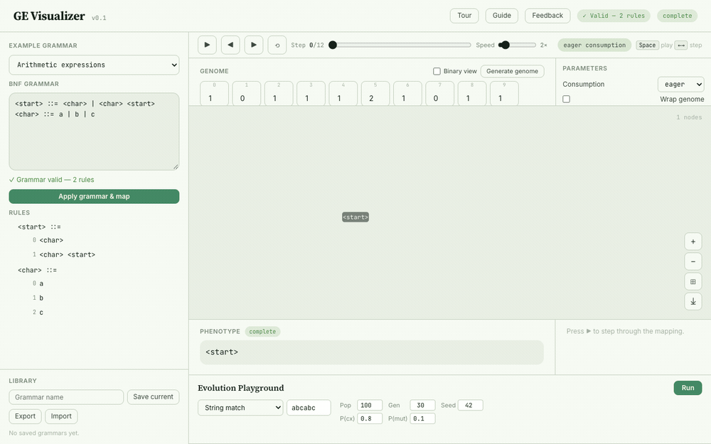
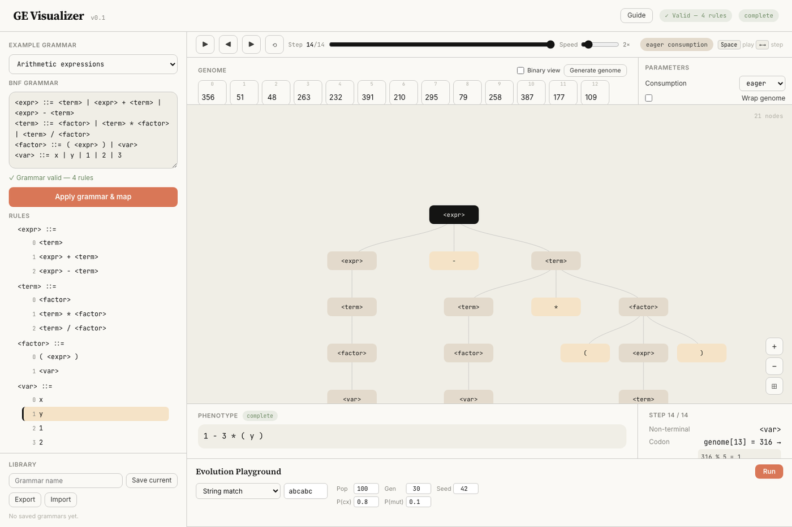
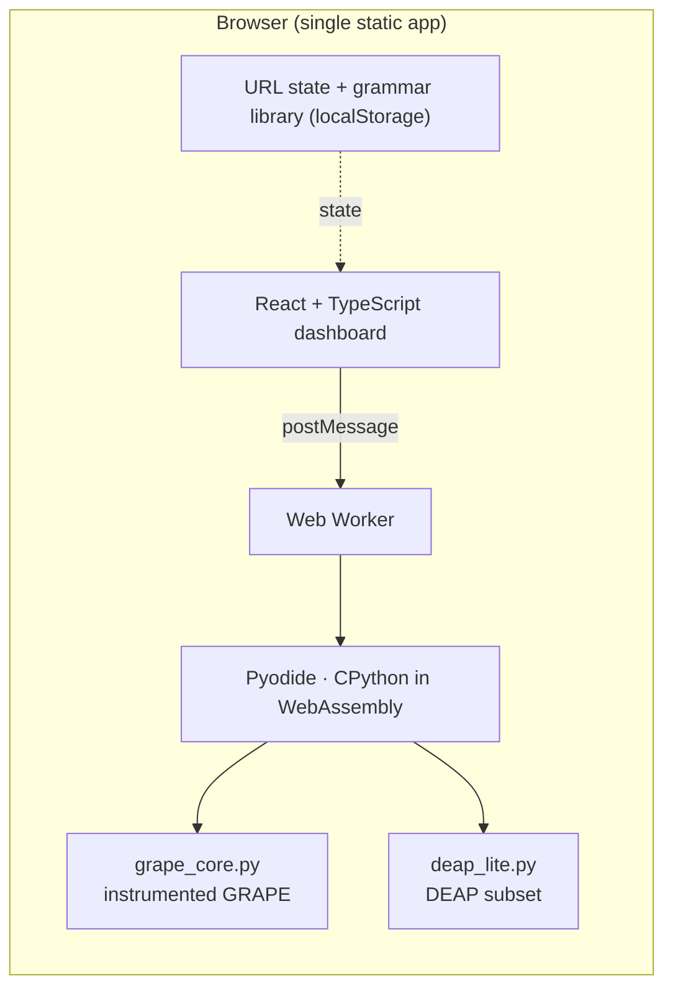
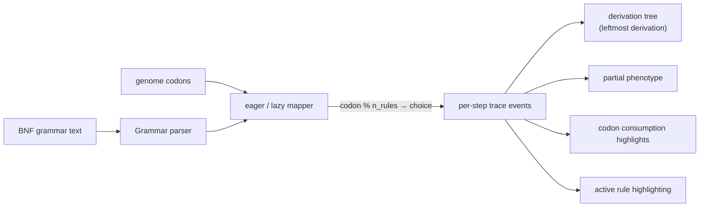
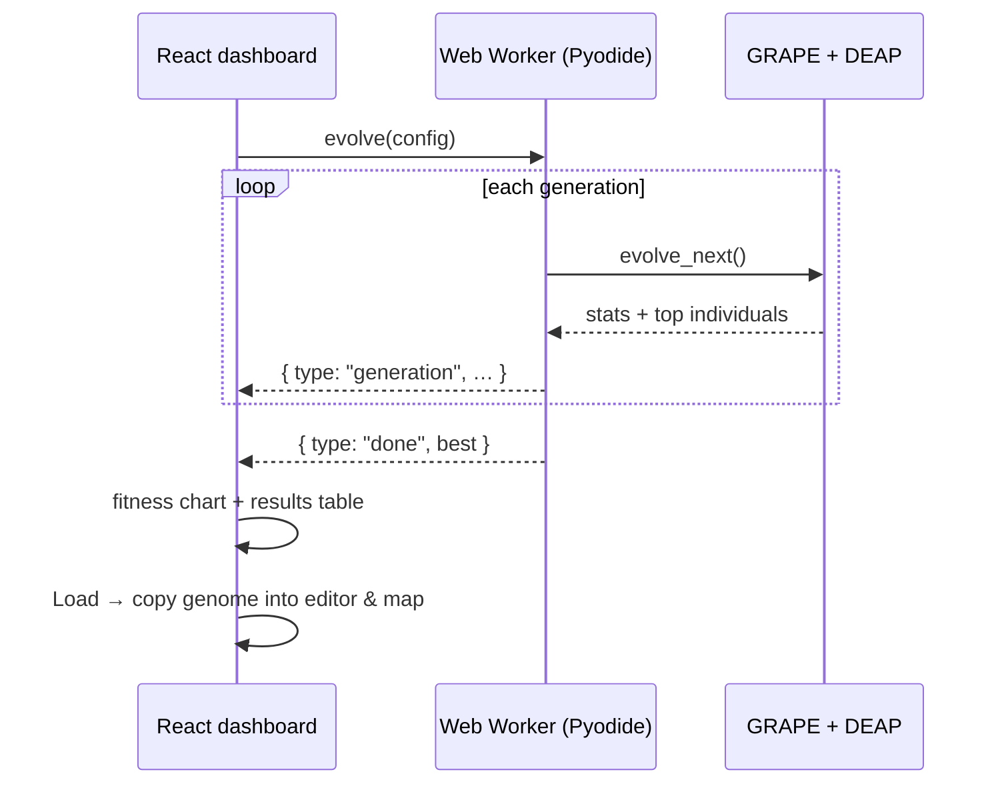

# GE Visualizer

Interactive visualization of Grammatical Evolution (GE): load a BNF grammar, generate or edit a
genome, and watch — step by step — how codons are consumed, how `codon % #choices` selects
production rules, how the derivation tree is constructed, and how the final phenotype emerges.
An evolution playground then runs a GRAPE + DEAP genetic algorithm and streams each generation as
it happens.

**It runs 100% in the browser.** The mapping and the evolution are executed by the real GRAPE
library, instrumented to emit a full per-step trace, running under [Pyodide](https://pyodide.org)
(CPython compiled to WebAssembly) inside a Web Worker. There is no server to start and nothing to
install beyond `npm install`.

## See it in action



_Each step is one grammar expansion: a codon is read, `codon % #choices` picks a production, and
the derivation tree, partial phenotype, active rule, and codon strip all update in sync._



## Features

- Live step-through of the genotype → phenotype mapping: synchronized highlights across the
  grammar rules, codon strip, derivation tree, and partial phenotype
- Playback with adjustable speed, keyboard shortcuts (`space`, arrows, `Home`, `End`)
- Responsive down to small phones: the panels stack, the page scrolls normally, and the tree
  supports pinch-to-zoom on touch screens
- Binary and codon genome editing with lossless representation switching
- "Suggest working settings": works out, from the grammar alone, a genome and depth that
  complete it — and reports what each consumption mode needs
- Target reachability: before an evolution run, the playground checks whether the grammar can
  derive the target at all, and says which characters make it impossible
- Eager/lazy codon consumption, depth limits, and optional genome wrapping, with clear
  explanations when a derivation stops
- Evolution playground: string match and symbolic regression problems with per-generation
  fitness charts, worked examples that reach a perfect score, a "how was this scored?"
  breakdown, and one-click drill-down into any individual
- Built-in grammar presets (arithmetic, boolean, strings, a 3-qubit Grover program generator),
  an interactive spotlight tour, and a Guide panel explaining every control and setting
- Export the derivation: the tree as SVG or PNG, and the full step trace as text or CSV
- In-app feedback that opens a prefilled GitHub issue with the current state included
- Shareable state via URL query parameters, plus a local grammar library with export/import
- Fully client-side: a static build you can host anywhere, with no backend or per-request cost

## Architecture



The dashboard derives the tree, phenotype, and every synchronized highlight from a single event
stream (one trace event per grammar expansion), so the view layer is pure client-side code.

### How a mapping becomes a picture



Each trace event records the non-terminal expanded, the codon read, the rule count, the chosen
production, and the resulting expansion.

### Evolution streaming



The GA runs in Python, but the worker pulls one generation at a time and posts each to the UI, so
the chart fills in live without blocking the page.

### Where the engine lives

- `frontend/src/engine/grape_core.py` — the instrumented GRAPE, with the numpy dependency removed
  so it runs under Pyodide.
- `frontend/src/engine/deap_lite.py` — a trimmed, pure-Python subset of DEAP 1.4.4:
  `Fitness`, `Toolbox`, `creator.create`, and `selTournament`.
- `frontend/src/engine/ge_bridge.py` — JSON-in/JSON-out entry points (`validate`, `map`,
  `suggest`, `analyse`, `explain`, `evolve_start`, `evolve_next`).
- `frontend/src/pyodide/engine.worker.ts` — boots Pyodide, writes the Python modules into its
  virtual filesystem, and serves requests from the main thread.
- `frontend/src/pyodide/client.ts` — the main-thread client: request/response correlation and
  evolution event fan-out.

See [`frontend/src/engine/THIRD_PARTY_NOTICES.md`](frontend/src/engine/THIRD_PARTY_NOTICES.md) for
the vendored-code provenance.

## Quickstart

Requires **Node 20+** (or 22+) and a modern browser: Pyodide needs WebAssembly and module Web
Workers.

```bash
cd frontend
npm install     # also copies the Pyodide runtime into public/pyodide/
npm run dev
```

Open http://localhost:5173. The first load takes a few seconds while it fetches the CPython runtime
once (~14 MB, served from your own build); after that it is instant and works offline.

## Build & deploy

```bash
cd frontend
npm run build   # → frontend/dist/, a fully static site
```

Serve `dist/` from any static host (GitHub Pages, Netlify, an S3 bucket, `python -m http.server`).
No backend, no proxy, no environment variables. Just make sure `.wasm` is served as
`application/wasm`, which is the default on most static hosts.

### Deploying to GitHub Pages

The repo ships a workflow (`.github/workflows/deploy.yml`) that tests, builds, and publishes to
Pages on every push to `main`. To switch it on:

1. Push this repository to GitHub.
2. In **Settings → Pages**, set **Source** to **GitHub Actions**.
3. Push to `main`, or run the workflow from the **Actions** tab.

A project site is served from `https://<user>.github.io/<repo>/`, so the build takes its base path
from the `BASE_PATH` env var; the workflow passes `/<repo>/` for you. Local builds stay at `/`, so
dev, preview, and the media capture are unaffected:

```bash
BASE_PATH=/GE-Visualizer/ npm run build   # what CI does
npm run build                             # local, served from /
```

For a custom domain, or a user site at `<user>.github.io`, set `BASE_PATH=/` — the `env:` block in
the workflow is the only place that needs changing.

`SITE_URL` is the absolute origin used by the `<link rel="canonical">` and Open Graph tags (link
previews need absolute URLs); it defaults to the GitHub Pages URL. Point it at your domain too:

```bash
BASE_PATH=/ SITE_URL=https://grammar.example.com/ npm run build
```

## Makefile

```bash
make setup          # install dependencies and fetch the Pyodide runtime
make dev            # local dev server on :5173
make preview        # serve the production build on :4173
make check          # typecheck + lint + tests + build + engine verification
make test           # frontend test suite
make typecheck      # tsc
make lint           # eslint
make build          # production build
make verify-engine  # run the in-browser engine under real Pyodide against the golden fixtures
make clean          # remove dist/ and the copied Pyodide runtime
make stop           # stop the dev and preview servers
make help           # list everything
```

## Tests

```bash
cd frontend
npm test               # 128 tests: view logic, components, playback, tour, export, feedback, engine client
npm run typecheck      # tsc
npm run lint           # eslint
npm run build          # tsc + vite build
npm run verify:engine  # the Python engine under real Pyodide, against the golden fixtures
```

With a preview server running (`npm run preview`), `npm run check:responsive` loads the app at
phone, tablet, and desktop widths and fails if anything overflows or forces mobile Chrome to zoom
the page out. `npm run capture:media` regenerates the screenshots above the same way.

The golden fixtures in `frontend/tests/fixtures/` were generated from the **unpatched** `grape-bds`
package, and `verify:engine` replays them through the browser engine — so a change to
`grape_core.py` that alters mapping behavior fails the suite.

## Project structure

- `frontend/` — the app and the whole runtime:
  - `src/engine/` — the Python GRAPE + DEAP engine that runs under Pyodide
  - `src/pyodide/` — the Web Worker, the main-thread client, and the load-status hook
  - `src/components/`, `src/lib/`, `src/hooks/` — the React dashboard and pure view logic
  - `tests/fixtures/` — golden fixtures produced by the unpatched `grape-bds`
  - `scripts/copy-pyodide.mjs` — vendors the Pyodide runtime into `public/pyodide/`
  - `scripts/verify-engine.mjs` — runs the engine under Pyodide against the golden fixtures
  - `scripts/capture-media.mjs` — captures the screenshots below (`npm run capture:media`)
- `docs/assets/` — the screenshots and animation used above

## License note

This project vendors a modified copy of GRAPE's `grape.py` (BSD-3-Clause, copyright BDS Research
Group at University of Limerick) for per-step trace instrumentation, plus a subset of DEAP
(LGPL-3.0) for the in-browser evolution. See
[`frontend/src/engine/THIRD_PARTY_NOTICES.md`](frontend/src/engine/THIRD_PARTY_NOTICES.md).
