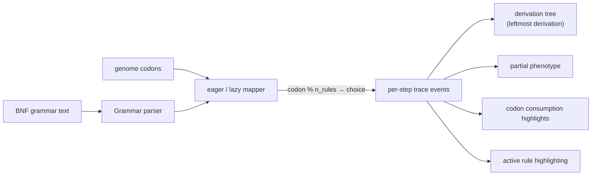
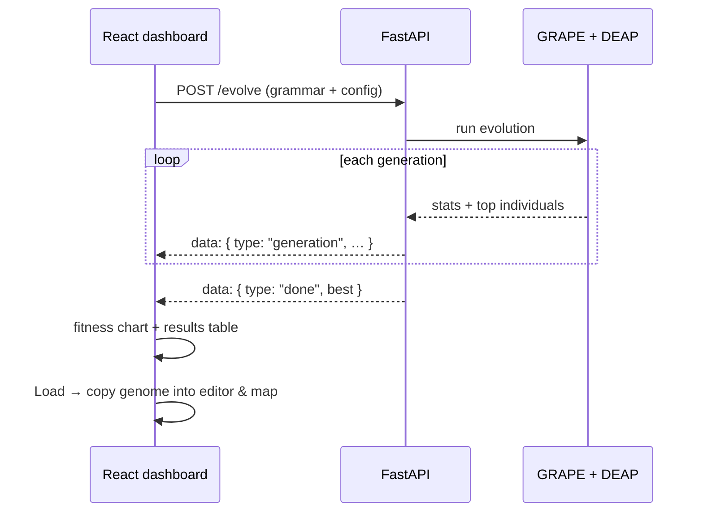

# GE Visualizer

Interactive visualization of Grammatical Evolution (GE): load a BNF grammar, generate or edit
a genome, and watch — step by step — how codons are consumed, how `codon % #choices` selects
production rules, how the derivation tree is constructed, and how the final phenotype emerges.
The mapping is executed by the real GRAPE library (`grape-bds`, instrumented to emit a full
per-step trace), and an optional GRAPE + DEAP evolution playground searches for phenotypes that
solve toy problems.

## See it in action


_Each step is one grammar expansion: a codon is read, `codon % #choices` picks a production, and
the derivation tree, partial phenotype, active rule, and codon strip all update in sync._


## Features

- Live step-through of the genotype → phenotype mapping: synchronized highlights across the
  grammar rules, codon strip, derivation tree, and partial phenotype
- Playback with adjustable speed, keyboard shortcuts (`space`, arrows, `Home`, `End`)
- Binary and codon genome editing with lossless representation switching
- Eager/lazy codon consumption, depth limits, and optional genome wrapping, with clear
  explanations when a derivation stops
- Evolution playground: string match and symbolic regression problems with per-generation
  fitness charts and one-click drill-down into any individual
- Built-in grammar presets (arithmetic, boolean, strings, a 3-qubit Grover program generator)
  and a "Guide" panel explaining every control and setting
- Shareable state via URL query parameters, plus a local grammar library with export/import

## System design

### Architecture

```mermaid
flowchart LR
  subgraph Browser["Browser"]
    UI["React + TypeScript dashboard<br/>(components · lib · hooks)"]
    Local["URL state + grammar library<br/>(localStorage)"]
  end
  subgraph Vite["Vite dev server"]
    Proxy["/api proxy"]
  end
  subgraph Backend["FastAPI backend (localhost:8000)"]
    Routes["routes: /grammar/validate · /map · /evolve"]
    Mapper["engine/mapper.py<br/>trace-aware mapping"]
    Evo["engine/evolution.py<br/>GRAPE + DEAP"]
    Grape["grape_traced.py<br/>instrumented grape-bds 0.1.3"]
    Schemas["schemas.py"]
  end
  UI -->|fetch /api/…| Proxy
  Proxy --> Routes
  Routes --> Mapper
  Routes --> Evo
  Mapper --> Grape
  Evo --> Grape
  Schemas -. frozen contract mirrored by frontend/src/types.ts .-> UI
  Local -. state .-> UI
```

The frontend never maps or evolves anything itself — every mapping and evolution run happens in
the real GRAPE library on the backend. The contract between the two sides (`backend/schemas.py`
↔ `frontend/src/types.ts`) is frozen and enforced by a schema-mirror test.

### How a mapping becomes a picture



Each trace event records the non-terminal expanded, the codon read, the rule count, the chosen
production, and the resulting expansion. The dashboard derives the tree prefix, phenotype, and
all synchronized highlights from that single event stream.

### Evolution streaming



## Quickstart

### Backend (FastAPI + grape-bds)

```bash
python3 -m venv venv
source venv/bin/activate
pip install -r backend/requirements.txt
uvicorn backend.main:app --reload
```

Health check: http://127.0.0.1:8000/health-check

### Frontend (React + Vite)

```bash
cd frontend
npm install
npm run dev
```

Open http://localhost:5173 — Vite proxies `/api` requests to the backend at
`http://127.0.0.1:8000`.

## Makefile

Common commands are wrapped in a `Makefile`:

```bash
make setup     # one-time: venv + backend + frontend dependencies
make api       # run the backend (uvicorn, reload on :8000)
make dev       # run the frontend dev server on :5173
make test      # backend + frontend test suites
make smoke     # e2e smoke test (needs `make api` and `make dev` running)
make lint      # eslint
make build     # production frontend build
make schemas   # regenerate the schema-mirror fixture
make fixtures  # regenerate GRAPE parity golden fixtures
```

`make help` lists everything.

## Tests

```bash
# backend (39 tests: mapping parity vs unpatched grape-bds, golden fixtures, evolution, API)
pytest

# frontend (89 tests: view logic, components, playback, URL state, schema mirror)
cd frontend && npm test && npm run typecheck && npm run lint && npm run build
```

## Project structure

- `backend/` — FastAPI app; `engine/grape_traced.py` is a vendored, instrumented copy of GRAPE
  (`grape-bds` 0.1.3, BSD-3-Clause — see `THIRD_PARTY_NOTICES.md`); `engine/mapper.py` exposes
  the trace API; `engine/evolution.py` runs the GRAPE/DEAP playground
- `frontend/` — React + TypeScript dashboard: `lib/` holds pure view logic (derivation tree,
  BNF display parsing, encoding, serialization), `components/` the panels
- `docs/ge-visualizer/development-plan.md` — the phased plan (Phases 0–7 complete)
- `docs/ge-visualizer/qa-checklist.md` — acceptance-criteria evidence and manual checklist
- `tools/reference_mapper.py` — regenerates golden fixtures from unpatched `grape-bds`
- `tools/export_schemas.py` — regenerates the schema-mirror fixture for the frontend
- `tools/e2e_smoke.py` — end-to-end smoke test against a running stack

## End-to-end smoke test

With both processes running:

```bash
python tools/e2e_smoke.py                                    # direct to the backend
python tools/e2e_smoke.py --base http://localhost:5173/api   # through the Vite proxy
```

## Deployment

The frontend is a static build (`cd frontend && npm run build`, serve `dist/`) and the backend
is a single FastAPI process. Point the static server at the backend (same origin or CORS).
Docker is intentionally not included — two local processes are all this project needs.

## License note

This project vendors a modified copy of GRAPE's `grape.py` (BSD-3-Clause, copyright BDS Research
Group at University of Limerick) for per-step trace instrumentation. The unpatched pip package
remains the parity oracle.
