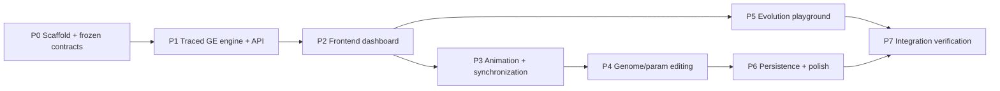

# GE Visualizer — Development Plan

Status: proposed, rev 2 (backend-backed) · 2026-09-01 · Stack: FastAPI + `grape-bds` backend,
TypeScript + React + Vite frontend

## 1. Goal

An interactive web app that makes the inner workings of Grammatical Evolution (GE) visible:
load/edit a BNF grammar, generate or edit a genome, and watch — step by step — how codons are
consumed, how `codon % #choices` selects production rules, how the derivation tree is
constructed, and how the final phenotype emerges. The mapping is executed by the real GRAPE
library (`grape-bds`, pip package for the bdsul/grape project), instrumented so every step is
exposed as data the frontend can render. A later phase adds an evolutionary playground running
GRAPE + DEAP server-side (population, fitness, selection, crossover, mutation) so the whole GE
pipeline is visualized end to end.

## 2. Architecture decisions

### 2.1 Decisions

| # | Decision | Rationale |
|---|----------|-----------|
| D1 | Backend-backed: FastAPI + `grape-bds` is the mapping engine; the frontend only renders the trace it returns. | The real GRAPE library stays in the loop — what you see is what GRAPE actually does, not a reimplementation. |
| D2 | Trace data comes from an instrumented copy of GRAPE's own mapper. | GRAPE's `Individual` returns only outcomes (phenotype, used_codons, structure), not per-step events. We vendor `grape.py` (BSD-3, notice retained) with the two mappers patched to also record every step. |
| D3 | 2D SVG/DOM visualization. No Three.js. | The story is labels and process (grammar rules, codon values, arithmetic), not 3D geometry. Text in 3D is hard to read; trees are the canonical 2D layout problem. |
| D4 | Single-page dashboard instead of a router/wizard. | The value is seeing genome, grammar, phenotype, and tree synchronize at once. Routing between isolated pages hides exactly what the tool exists to show. |
| D5 | Keep React + Vite; add TypeScript, Vitest, d3-hierarchy. | React/Vite already exist and are right-sized. TypeScript mirrors the backend schemas safely; d3-hierarchy gives a proven tidy-tree layout; Vitest gives fast unit tests. |
| D6 | Evolution runs server-side with GRAPE + DEAP and streams generation stats to the UI. | `grape-bds` ships DEAP-based algorithms; reimplementing the GA client-side would duplicate (and risk diverging from) real behavior. |
| D7 | The backend is rebuilt cleanly, not resurrected from the old one. | The old backend was non-runnable (gitignored `grape/` clone, missing constructor arg) and returned no trace. New backend depends on pip-installed `grape-bds` + one vendored, instrumented file. |

### 2.2 Removed / kept / added

**Removed**
- Old `backend/` implementation (FastAPI + broken GRAPE vendoring), empty root `Dockerfile` /
  `docker-compose.yml` stubs, `scripts/`
- `@react-three/fiber`, `@react-three/drei`, `three`, `react-router-dom`, `axios`
- Old `TreeVisualization.jsx` 3D renderer, `GeneratePhenotype.jsx`, `SetParameters.jsx`, `UploadGrammar.jsx`
- Empty `docs/architecture.md`, `docs/api_spec.md`, `docs/README.md`
- `.gitignore` entry for the vendored `grape/` directory

**Kept**: React, Vite, ESLint, the FastAPI concept, GRAPE itself (now via `pip install grape-bds`),
the "grammar → genome → phenotype → visualization" flow.

**Added**: TypeScript, Vitest, `d3-hierarchy`, `backend/engine/grape_traced.py` (vendored,
instrumented GRAPE mapper), `tools/reference_mapper.py` (parity oracle), shared pydantic/TS
schemas, example grammars, toy fitness problems.

### 2.3 Target repository layout

```
GE-Visualizer/
├── README.md
├── docker-compose.yml            # Phase 7, optional convenience
├── docs/ge-visualizer/development-plan.md
├── tools/
│   └── reference_mapper.py       # runs unpatched grape-bds to emit golden JSON fixtures
├── backend/
│   ├── requirements.txt          # fastapi, uvicorn, grape-bds, pydantic
│   ├── main.py                   # FastAPI app
│   ├── schemas.py                # FROZEN pydantic contracts (§5)
│   ├── engine/
│   │   ├── __init__.py
│   │   ├── THIRD_PARTY_NOTICES.md  # BSD-3 notice for vendored grape code
│   │   ├── grape_traced.py         # vendored grape.py with traced mappers
│   │   ├── mapper.py               # trace-aware mapping API (uses grape_traced)
│   │   └── evolution.py            # Phase 5: GRAPE/DEAP runs
│   └── tests/
│       ├── test_mapper.py
│       ├── test_parity.py          # traced vs unpatched grape-bds
│       └── test_api.py
└── frontend/
    ├── index.html
    ├── package.json
    ├── tsconfig.json
    ├── vite.config.ts              # dev proxy → backend
    └── src/
        ├── main.tsx
        ├── App.tsx
        ├── styles.css
        ├── types.ts                # mirrors backend schemas (§5)
        ├── api.ts                  # fetch wrappers
        ├── state.tsx               # reducer + actions
        ├── hooks/
        │   ├── usePlayback.ts
        │   └── useUrlState.ts
        ├── components/
        │   ├── GrammarPanel.tsx
        │   ├── GenomeStrip.tsx
        │   ├── GenomeEditor.tsx
        │   ├── ParamsPanel.tsx
        │   ├── DerivationTree.tsx
        │   ├── PhenotypeView.tsx
        │   ├── StepDetail.tsx
        │   ├── Controls.tsx
        │   ├── GrammarLibrary.tsx
        │   └── EvolutionPanel.tsx
        └── examples/
            ├── grammars.ts          # built-in BNF examples
            └── problems.ts          # Phase 5 toy fitness problems
```

## 3. Requirements contract

| ID | Requirement |
|----|-------------|
| FR-01 | Load and edit a BNF grammar (textarea + built-in examples + validation errors). |
| FR-02 | Parse BNF into a typed model via GRAPE's Grammar: start rule, non-terminals, ordered productions, arity. |
| FR-03 | Generate or edit genomes in binary or codon-list form; binary is decoded into codons (bits per codon) before GRAPE sees it. |
| FR-04 | Map genome → phenotype server-side with GRAPE's (instrumented) mapper: leftmost derivation, `codon % n_rules`, eager/lazy consumption, per-branch max depth, invalid detection. |
| FR-05 | Emit a complete per-step trace (step, non-terminal, codon index/value, rule count, choice, expansion, partial phenotype, depth, consumed flag, complete flag). |
| FR-06 | Render the growing derivation tree in 2D SVG with tidy layout and node labels. |
| FR-07 | Step-through controls (fwd/back, play/pause, speed, reset, jump) with synchronized highlighting across genome, grammar, phenotype, and tree. |
| FR-08 | Per-step detail card explaining the codon → choice arithmetic. |
| FR-09 | Visualize edge cases: depth-limit truncation, invalid derivation, eager vs lazy consumption, optional wrapping with wrap counter. |
| FR-10 | Server-side GRAPE + DEAP evolution loop (population init, fitness, tournament selection, crossover, mutation) with generation stats streamed to the UI and drill-down into any individual's mapping. |
| FR-11 | Persistence and shareability: state in URL query params, localStorage grammar library, export/import. |
| FR-12 | Polish: responsive layout, dark theme, keyboard shortcuts, empty/error states. |

## 4. Phase dependency graph



Critical path: **P0 → P1 → P2 → P3 → P4 → P6 → P7**. P5 runs in parallel after P2.
No phase is blocked by more than one dependency.

## 5. Frozen interfaces (Phase 0 contract)

These are frozen for the duration of the epic. Changing them requires re-planning.
Single source of truth: `backend/schemas.py` (pydantic). `frontend/src/types.ts` mirrors them
exactly; a Phase 7 check asserts the mirror stays in sync.

```python
class GEParams(BaseModel):
    codon_size: int = 400            # codon values in [0, codon_size)
    bits_per_codon: int = 8          # binary decode width
    consumption: Literal["eager", "lazy"]
    max_depth: int = 40              # per-branch depth limit
    genome_representation: Literal["binary", "codons"]
    wrap: bool = False               # optional extension; GRAPE itself does not wrap

class MapRequest(BaseModel):
    grammar_text: str
    genome: list[int]                # codon values when representation == "codons",
                                     # raw bits (0/1 ints) when "binary"
    params: GEParams

class TraceStep(BaseModel):
    step: int
    non_terminal: str
    codon_index: int                 # may exceed genome length when wrapping
    codon_value: int
    rule_count: int
    choice: int                      # codon_value % rule_count
    expansion: str                   # chosen production as text
    partial_phenotype: str
    depth: int
    wraps: int
    consumed: bool                   # false when lazy mode skips a single-option rule
    complete: bool                   # true if this step terminates the derivation

class DerivationNode(BaseModel):
    id: str
    label: str                       # terminal text or non-terminal name
    kind: Literal["root", "nonterminal", "terminal"]
    step: int | None                 # trace step that created this node
    codon_index: int | None
    choice: int | None
    children: list["DerivationNode"]

class MapResponse(BaseModel):
    genome: list[int]                # decoded codons actually given to GRAPE
    params: GEParams
    trace: list[TraceStep]
    phenotype: str
    status: Literal["complete", "invalid", "depth-limited"]
    summary: dict                    # used_codons, nodes, depth, n_wraps
```

**Engine semantics notes (mirror GRAPE — pip package `grape-bds` 0.1.3, source repo
bdsul/grape, `grape.py`):**
- Leftmost derivation: always expand the first remaining non-terminal in the partial phenotype.
- Choice = `codon % n_rules(NT)`; production 0 when `n_rules == 1` under lazy consumption (no codon consumed).
- Eager consumption consumes a codon for every expansion; lazy only when `n_rules > 1`.
- Depth is tracked per branch; exceeding `maxDepth` truncates and marks the derivation
  `depth-limited`; `invalid` when non-terminals remain after the genome is exhausted and wrapping
  is off.
- Binary genomes are decoded into codon lists (MSB-first, `bits_per_codon` per codon, partial
  trailing bits truncated) before GRAPE runs. GRAPE itself operates on integer lists.
- Wrapping is our optional extension (default off): when the genome is exhausted and
  non-terminals remain, re-use codons from index 0 and increment the wrap counter.
- License: bdsul/grape is BSD-3-Clause; `grape_traced.py` keeps the original copyright notice
  and `THIRD_PARTY_NOTICES.md` documents the modification (instrumented mappers only).

## 6. Estimation heuristics

| Size | Criteria | Typical scope |
|------|----------|---------------|
| S | Single file change, well-understood pattern | < 2 hours |
| M | Multi-file, single module, clear interface | 2–8 hours |
| L | Cross-module, interface changes, new patterns | 1–3 days |
| XL | Architectural change, new infrastructure, high uncertainty | 3–5 days |

No task in this plan exceeds L.

## 7. Phases

### Phase 0: Scaffold & frozen contracts

**Input artifacts**: existing repo as committed (old frontend/backend, empty docs).

**Output artifacts**:
- Repo layout per §2.3: `backend/` and `frontend/` skeletons, `tools/`
- `backend/requirements.txt` (`fastapi`, `uvicorn`, `grape-bds`, `pydantic`), `backend/main.py`
  (health check only), `backend/schemas.py` (frozen §5 contracts)
- `frontend/package.json`, `tsconfig.json`, `vite.config.ts` (dev proxy to backend), `index.html`
- `frontend/src/types.ts` (mirror of schemas), `frontend/src/examples/grammars.ts`
- `docs/ge-visualizer/development-plan.md` (this file)
- Removed: old backend, scripts, Docker stubs, empty docs, old frontend pages and deps
- `backend/engine/THIRD_PARTY_NOTICES.md` (BSD-3 notice, modification statement)

**Requirement IDs addressed**: FR-01 (examples), FR-02/FR-05 (contracts), FR-03/FR-04 (param types).

**External docs needed**: [Vite guide](https://vite.dev/guide/), [React docs](https://react.dev/learn),
[TypeScript handbook](https://www.typescriptlang.org/docs/), [Vitest guide](https://vitest.dev/guide/),
[FastAPI docs](https://fastapi.tiangolo.com/), [GRAPE source](https://github.com/bdsul/grape),
[grape-bds on PyPI](https://pypi.org/project/grape-bds/). All public and reachable — no halt.

#### Tasks
| Task | Description | Output file(s) | Effort |
|------|-------------|----------------|--------|
| Restructure repo | Create backend/frontend/tools layout; delete old code and empty stubs; clean .gitignore | repo layout | M |
| Backend skeleton | requirements.txt, FastAPI app with /health-check, pydantic schemas | backend/* | M |
| Vendored GRAPE | Copy `grape.py` → `grape_traced.py` unmodified for review; write notices | backend/engine/grape_traced.py, THIRD_PARTY_NOTICES.md | S |
| Frontend skeleton | Vite + React + TS + Vitest; dev proxy; types mirroring schemas | frontend/* | M |
| Example grammars | 3 valid BNF grammars as typed constants | frontend/src/examples/grammars.ts | S |
| Test harness | Vitest + pytest both green with trivial tests | configs | S |

#### Verification criteria
| ID | Assertion | How to test | Pass condition |
|----|-----------|-------------|----------------|
| V0.1 | Frontend builds | `npm run build` (in frontend/) | No TS/build errors |
| V0.2 | Backend boots | `uvicorn backend.main:app` | /health-check returns 200 |
| V0.3 | Deps install | `pip install -r backend/requirements.txt` | grape-bds 0.1.3 importable |
| V0.4 | Contracts locked | Review of schemas.py + types.ts | Mirrors are 1:1; no drift |

#### Rollback boundary
`git checkout` of the Phase 0 commit. Keep the plan doc.

#### Deliverable checklist
- [ ] Repo restructured to §2.3 layout
- [ ] Frozen schemas reviewed and locked
- [ ] All verification criteria pass

### Phase 1: Traced GE engine + API

**Input artifacts**: Phase 0 schemas, vendored `grape_traced.py`, example grammars, test harnesses.

**Output artifacts**: `backend/engine/mapper.py`, instrumented `grape_traced.py`, API routes
(`POST /map`, `POST /grammar`, `GET /grammar`), backend tests, `tools/reference_mapper.py`,
golden fixture JSON.

**Requirement IDs addressed**: FR-02, FR-03 (decode), FR-04, FR-05, FR-09 (logic).

**External docs needed**: [GRAPE source](https://github.com/bdsul/grape) (`grape.py` mapper
functions), [grape-bds on PyPI](https://pypi.org/project/grape-bds/). Reachable — no halt.

#### Tasks
| Task | Description | Output file(s) | Effort |
|------|-------------|----------------|--------|
| Instrument mappers | Patch `mapper_lazy`/`mapper_eager` in grape_traced.py to record a TraceStep per expansion (codon, NT, arity, choice, expansion, partial phenotype, depth, consumed, complete) | backend/engine/grape_traced.py | L |
| Mapper API | `map_with_trace(grammar_text, genome, params) -> MapResponse`; binary decode; wrap extension; status classification | backend/engine/mapper.py | M |
| Routes | POST /map (validate + return trace), POST /grammar (store in memory), GET /grammar | backend/main.py (or routes.py) | M |
| Parity tests | Run same inputs through unpatched grape-bds `Individual` and traced mapper; assert phenotype/used_codons/structure identical | backend/tests/test_parity.py | M |
| Golden fixtures | `tools/reference_mapper.py` emits JSON from unpatched grape-bds for eager/lazy, arity, depth-limit cases; fixtures checked in | tools/reference_mapper.py, backend/tests/fixtures/*.json | M |
| Edge tests | Depth limit, exhausted genome, single-option lazy skip, wrap on/off | backend/tests/test_mapper.py | M |

#### Verification criteria
| ID | Assertion | How to test | Pass condition |
|----|-----------|-------------|----------------|
| V1.1 | Trace complete | POST /map on fixture genome | Every step has all fields; partial phenotype sequence valid |
| V1.2 | Parity with real GRAPE | test_parity.py | Identical phenotype + consumed codon sequence vs unpatched grape-bds |
| V1.3 | Binary decode | Map with binary genome | Decoded codons match expected; round-trip deterministic |
| V1.4 | Edge semantics | Depth-limit, exhausted genome, lazy skip, wrap | Statuses and step flags correct |

#### Rollback boundary
Revert `backend/engine/*` + routes + tests. Schemas stay frozen.

#### Deliverable checklist
- [ ] /map returns full trace for any valid grammar+genome+params
- [ ] Parity suite green against unpatched grape-bds
- [ ] All verification criteria pass

### Phase 2: Frontend dashboard

**Input artifacts**: Phase 1 API + trace contract; Phase 0 types and examples.

**Output artifacts**: `frontend/src/api.ts`, `frontend/src/state.tsx`, `frontend/src/App.tsx`,
`frontend/src/styles.css`, components `GrammarPanel.tsx`, `GenomeStrip.tsx`, `DerivationTree.tsx`,
`PhenotypeView.tsx`, `StepDetail.tsx`, `Controls.tsx`, component tests.

**Requirement IDs addressed**: FR-01 (panel/validation), FR-06, FR-07 (basic stepping), FR-08, FR-12 (base layout).

**External docs needed**: [d3-hierarchy](https://d3js.org/d3-hierarchy), [React docs](https://react.dev/learn).
Reachable — no halt.

#### Tasks
| Task | Description | Output file(s) | Effort |
|------|-------------|----------------|--------|
| API client | fetch wrappers for /map, /grammar; error normalization | src/api.ts | S |
| App shell | Dashboard grid: grammar left, genome strip top, tree center, phenotype + detail bottom, controls bar | src/App.tsx, src/styles.css | M |
| Reducer | Async MAP via api.ts; STEP_FWD/BACK move `currentStep` | src/state.tsx | M |
| Grammar panel | Edit textarea, upload on change, validation errors from API | GrammarPanel.tsx | M |
| Genome strip | Render codons as boxes with index labels; binary view toggle (basic) | GenomeStrip.tsx | M |
| Derivation tree | d3-hierarchy tidy layout from trace prefix; SVG nodes/edges with labels | DerivationTree.tsx | L |
| Phenotype + detail | Partial phenotype string; step card with NT, codon, modulo arithmetic | PhenotypeView.tsx, StepDetail.tsx | M |
| Controls | Step fwd/back, reset, jump slider (play/pause in Phase 3) | Controls.tsx | S |
| Component tests | Render each panel with fixture trace | frontend tests | M |

#### Verification criteria
| ID | Assertion | How to test | Pass condition |
|----|-----------|-------------|----------------|
| V2.1 | Full flow works | Backend up; load example → generate genome → MAP | Trace fetched; stepping updates panels |
| V2.2 | Tree matches trace | Fixture genome | Rendered node labels match expected derivation |
| V2.3 | Grammar validation | Paste malformed BNF | Inline error from API, no crash |
| V2.4 | Error states | Backend down | Friendly retry message, app doesn't hang |

#### Rollback boundary
Revert `frontend/src/` components/state/App. Backend untouched.

#### Deliverable checklist
- [ ] Dashboard renders all five panels from live API data
- [ ] Step-through works with the tree growing
- [ ] All verification criteria pass

### Phase 3: Animation & synchronization

**Input artifacts**: Phase 2 dashboard + reducer.

**Output artifacts**: `frontend/src/hooks/usePlayback.ts`, updates to `Controls.tsx`,
`GenomeStrip.tsx`, `DerivationTree.tsx`, `StepDetail.tsx`, `state.tsx` (playback fields), CSS
transitions.

**Requirement IDs addressed**: FR-07, FR-08 (highlight sync), FR-09 (UI).

**External docs needed**: none beyond Phase 2 docs.

#### Tasks
| Task | Description | Output file(s) | Effort |
|------|-------------|----------------|--------|
| Playback hook | Play/pause with speed control, timer-sourced stepping, cleanup | usePlayback.ts | M |
| Controls upgrade | Play/pause, speed slider, keyboard shortcuts (space, arrows, home/end) | Controls.tsx | M |
| Synchronized highlights | Active codon pulse, active rule in grammar panel, active tree node, wrap badge | GenomeStrip/StepDetail/DerivationTree/GrammarPanel | M |
| Edge-case UI | Depth-limit and invalid banners with explanation; eager vs lazy indicator | App.tsx + components | S |
| Hook tests | Fake timers verify cadence and cleanup | frontend tests | S |

#### Verification criteria
| ID | Assertion | How to test | Pass condition |
|----|-----------|-------------|----------------|
| V3.1 | Playback | Play a long trace | Steps advance at selected speed; pause halts |
| V3.2 | Keyboard | Space/arrows | Work with and without focus |
| V3.3 | Sync | Watch one full playback | All panels highlight the same step simultaneously |
| V3.4 | Edge banners | Depth-limited/invalid genome | Correct banner and explanation |

#### Rollback boundary
Revert playback hook + animation-related changes. Static dashboard remains usable.

#### Deliverable checklist
- [ ] Playback + keyboard controls working
- [ ] Cross-panel highlights in sync
- [ ] All verification criteria pass

### Phase 4: Genome & parameter editing

**Input artifacts**: Phase 2/3 dashboard; Phase 0 contracts.

**Output artifacts**: `frontend/src/components/GenomeEditor.tsx`, `ParamsPanel.tsx`, updates to
`state.tsx` (SET_GENOME/SET_PARAMS already defined), additive fields to types if needed.

**Requirement IDs addressed**: FR-03 (editing UI), FR-04 (param-driven behavior).

**External docs needed**: none.

#### Tasks
| Task | Description | Output file(s) | Effort |
|------|-------------|----------------|--------|
| Genome editor | Edit codon values inline, regenerate random genome, toggle binary/codon view | GenomeEditor.tsx | M |
| Params panel | Codon size, bits per codon, consumption mode, max depth, genome length, wrap toggle; re-map on change | ParamsPanel.tsx | M |
| Validation | Block invalid params (codon size ≤ 1, bits < 1, depth < 1, empty genome) client-side before API call | ParamsPanel/state | S |
| Tests | Editing round-trip, param-change re-mapping | frontend tests | S |

#### Verification criteria
| ID | Assertion | How to test | Pass condition |
|----|-----------|-------------|----------------|
| V4.1 | Edit propagates | Change a codon value | Re-map via API; tree/phenotype update |
| V4.2 | Binary↔codons | Toggle representation both ways | No value loss for full-width codons |
| V4.3 | Mode switch | Flip eager/lazy | Trace shows codon-skip on single-option rules under lazy |
| V4.4 | Invalid input | Bad params | Blocked with message; state unchanged |

#### Rollback boundary
Revert the two new components + state updates. Dashboard still works with defaults.

#### Deliverable checklist
- [ ] All GE params editable with live re-mapping
- [ ] Genome editable in both representations
- [ ] All verification criteria pass

### Phase 5: Evolution playground (parallel to P3/P4)

**Input artifacts**: Phase 2 dashboard, Phase 1 engine/API, Phase 0 contracts.

**Output artifacts**: `backend/engine/evolution.py`, `POST /evolve` (streamed generation stats),
`frontend/src/components/EvolutionPanel.tsx`, `frontend/src/examples/problems.ts`, backend + frontend tests.

**Requirement IDs addressed**: FR-10.

**External docs needed**: [DEAP docs](https://deap.readthedocs.io/), [GRAPE paper](https://www.mdpi.com/2624-6120/3/3/39)
(algorithm defaults). Reachable — no halt.

#### Tasks
| Task | Description | Output file(s) | Effort |
|------|-------------|----------------|--------|
| GA service | GRAPE + DEAP run: population init, fitness, tournament selection, crossover, mutation, elitism; per-generation stats + best individuals | backend/engine/evolution.py | L |
| Streaming endpoint | POST /evolve returning generation stats incrementally (SSE or chunked JSON) | backend routes | M |
| Toy problems | String-match and simple symbolic-regression fitness targets | frontend/src/examples/problems.ts | S |
| Evolution panel | Run controls (pop size, gens, rates), live fitness curves, population table | EvolutionPanel.tsx | L |
| Drill-down | Click individual → call /map with its genome → load into main dashboard | state.tsx + panel | S |
| Tests | Deterministic seeded convergence on easy target; endpoint shape | backend + frontend tests | M |

#### Verification criteria
| ID | Assertion | How to test | Pass condition |
|----|-----------|-------------|----------------|
| V5.1 | Converges | Seeded string-match run | Best fitness non-worsening; optimum reached on easy target |
| V5.2 | Streaming | 500 inds × 100 gens | Stats update per generation without jank |
| V5.3 | Drill-down | Click an individual | Main dashboard shows its genome + mapping |
| V5.4 | No regressions | Full test suite | All prior tests green |

#### Rollback boundary
Revert evolution.py, problems.ts, EvolutionPanel.tsx. Main dashboard untouched.

#### Deliverable checklist
- [ ] GA runs with live charts from real GRAPE/DEAP
- [ ] Drill-down into any individual's mapping
- [ ] All verification criteria pass

### Phase 6: Persistence & polish

**Input artifacts**: Phase 3/4 dashboard; Phase 0 contracts.

**Output artifacts**: `frontend/src/lib/serialization.ts`, `frontend/src/hooks/useUrlState.ts`,
`frontend/src/components/GrammarLibrary.tsx`, updated `styles.css`, final `README.md` section,
optional `docker-compose.yml`.

**Requirement IDs addressed**: FR-11, FR-12.

**External docs needed**: none.

#### Tasks
| Task | Description | Output file(s) | Effort |
|------|-------------|----------------|--------|
| Serializer | UI state ↔ URL query string (grammar, genome, params, step) | serialization.ts | M |
| URL hook | Restore on load, pushState on change, debounced | useUrlState.ts | M |
| Grammar library | localStorage save/load/delete named grammars; export/import file | GrammarLibrary.tsx | M |
| Polish | Dark theme, responsive breakpoints, empty/error states, focus styles | styles.css + components | M |
| Optional compose | Two-service docker-compose for convenience | docker-compose.yml | S |
| README | Quickstart (two commands), screenshot, feature tour, deploy note | README.md | S |

#### Verification criteria
| ID | Assertion | How to test | Pass condition |
|----|-----------|-------------|----------------|
| V6.1 | URL round-trip | Copy URL into new tab | Identical state restored |
| V6.2 | Library persists | Save grammar, reload | Grammar present |
| V6.3 | Responsive | 1280 / 768 / 375 px | No overflow; controls usable |
| V6.4 | Accessibility | Keyboard nav + screen reader spot-check | Focus visible; controls labeled |

#### Rollback boundary
Revert serialization + library + CSS changes. Core app unchanged.

#### Deliverable checklist
- [ ] Shareable URL state
- [ ] Local grammar library
- [ ] Responsive dark theme
- [ ] All verification criteria pass

### Phase 7: Integration verification

**Input artifacts**: all prior phases.

**Output artifacts**: final `README.md`, `docs/ge-visualizer/qa-checklist.md`, schema-mirror check,
release tag.

**Requirement IDs addressed**: all (final acceptance).

**External docs needed**: none.

#### Tasks
| Task | Description | Output file(s) | Effort |
|------|-------------|----------------|--------|
| End-to-end scenario | Scripted walkthrough: load grammar → generate genome → step through → phenotype | qa-checklist.md | M |
| Parity re-check | Traced mapper vs unpatched grape-bds on full fixture set | backend/tests/test_parity.py | S |
| Schema mirror check | Assert frontend types match backend schemas (codegen or test) | frontend tests | S |
| Regression sweep | Full backend + frontend test suites, typecheck, build | — | S |
| QA checklist | Manual checklist covering every FR/AC | qa-checklist.md | S |
| Release | Tag `v1.0`, document two-command startup + optional compose | README.md | S |

#### Verification criteria
| ID | Assertion | How to test | Pass condition |
|----|-----------|-------------|----------------|
| V7.1 | FR-01…FR-12 demonstrable | QA checklist walkthrough | Every box checked |
| V7.2 | GRAPE parity | Parity suite | Identical results on all shared fixtures |
| V7.3 | Green pipeline | Backend pytest + `npm run lint && npm test && npm run build` | All pass |
| V7.4 | Fresh-clone experience | Clone, install both sides, start both | Zero-setup run with README commands |

#### Rollback boundary
Tag `v1.0-pre-final` before QA; revert only if acceptance fails.

#### Deliverable checklist
- [ ] All acceptance criteria (§9) met
- [ ] QA checklist complete
- [ ] Release tagged and documented

## 8. Requirement coverage check

No orphaned requirements:

| FR | Phases |
|----|--------|
| FR-01 | 0, 2, 6 |
| FR-02 | 0, 1 |
| FR-03 | 1, 4, 5 |
| FR-04 | 1, 4 |
| FR-05 | 0, 1 |
| FR-06 | 2 |
| FR-07 | 2, 3 |
| FR-08 | 2, 3 |
| FR-09 | 1, 3 |
| FR-10 | 5 |
| FR-11 | 6 |
| FR-12 | 2, 6, 7 |

## 9. Acceptance criteria (original)

- AC-1 Load/edit BNF grammar with examples and useful validation errors.
- AC-2 Generate or edit genomes in binary or codon form; representations stay consistent (binary is decoded to codons before GRAPE runs).
- AC-3 Step through mapping with full per-step detail and synchronized highlights across grammar, genome, phenotype, and tree.
- AC-4 Derivation tree renders and grows in sync; final tree matches final phenotype.
- AC-5 Edge cases visible: depth limit, invalid derivation, eager vs lazy, wrapping.
- AC-6 Evolution playground runs a real GRAPE/DEAP GA with drill-down into any individual.
- AC-7 State shareable via URL; grammar library persists locally.
- AC-8 Responsive, keyboard-accessible, dark-themed.
- AC-9 Runs locally with two processes (uvicorn + vite dev); optional docker-compose; no external services.
- AC-10 Mapping results (trace and phenotype) match unpatched `grape-bds` exactly on shared fixtures.
